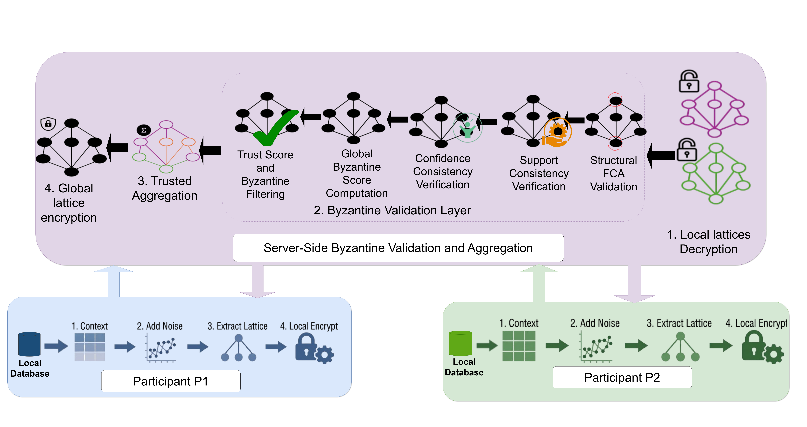

# 🛡️ BR-FedFCA
## Byzantine-Resilient Federated Formal Concept Analysis

BR-FedFCA is a Byzantine-resilient and privacy-preserving **Federated Formal Concept Analysis (FedFCA)** framework designed for secure distributed concept lattice construction and trustworthy association rule mining under adversarial environments.

The framework enables multiple federated participants to collaboratively construct a global concept lattice **without sharing raw local data**, while protecting the aggregation process against malicious behaviors such as fake concept injection, support manipulation, confidence corruption, structurally invalid lattices, and collusion attacks.

BR-FedFCA integrates a dedicated Byzantine Validation Layer combining structural FCA verification, support consistency analysis, confidence consistency analysis, trust-aware filtering, and voting-based aggregation validation mechanisms to improve the robustness and reliability of federated FCA systems.

---

# 🌐 Global Architecture

The BR-FedFCA architecture is composed of distributed federated participants and a centralized Byzantine-resilient aggregation server.

---

# 👥 Federated Participants

Each participant locally performs the following operations:

- 📂 Builds a local formal context
- 🔒 Applies Local Differential Privacy (LDP) perturbation
- 🧠 Generates a local concept lattice
- 🔐 Encrypts local FCA outputs
- 📡 Securely transmits encrypted lattices to the aggregation server

The local computation process preserves data locality and prevents direct raw data sharing between participants.

---

# 🖥️ Byzantine-Resilient Aggregation Server

The aggregation server is responsible for:

- 🔓 Decrypting received local lattices
- ✅ Verifying FCA structural consistency
- 📊 Evaluating support consistency
- 📈 Evaluating confidence consistency
- 🧮 Computing Byzantine deviation scores
- 🤝 Computing participant trust scores
- 🚫 Filtering suspicious participants
- 🌐 Performing trusted lattice aggregation
- 🗳️ Constructing the secure global concept lattice

The server integrates a Byzantine Validation Layer to detect malicious and inconsistent local FCA updates before global aggregation.

---

# ✨ Main Features

- 🔒 Privacy-preserving Federated FCA
- 🛡️ Byzantine-resilient concept aggregation
- 📐 FCA closure property verification
- 📏 Partial order consistency validation
- 🔗 Meet/join lattice consistency verification
- 📊 Support consistency analysis
- 📈 Confidence consistency analysis
- 🧮 Byzantine score computation
- 🤝 Trust-aware participant filtering
- 🌍 Secure global lattice aggregation
- ⚡ Robustness under IID and Non-IID environments
- 📡 Scalable distributed FCA architecture

---

# ⚠️ Threat Model

BR-FedFCA considers multiple Byzantine attack scenarios that may compromise the global lattice aggregation process, including:

- ❌ Fake concept injection
- 📉 Support manipulation attacks
- 📈 Confidence manipulation attacks
- 🧨 Structurally invalid lattice generation
- 🔥 Corrupted local FCA outputs
- 🤝 Collusion attacks between malicious participants

These attacks aim to alter the structural consistency and semantic reliability of the global concept lattice.

---

# 🧠 Byzantine Validation Layer

The proposed Byzantine Validation Layer combines several complementary verification mechanisms.

---

## 📐 Structural FCA Validation

The server validates:

- ✅ FCA closure property consistency
- 🔗 Partial order preservation
- ⚙️ Meet and join operation consistency

This step ensures that received concepts preserve valid FCA lattice structures.

---

## 📊 Support Consistency Verification

The server compares local support values with global aggregated support statistics in order to detect anomalous or manipulated concepts.

---

## 📈 Confidence Consistency Verification

Confidence values of generated association rules are evaluated to identify suspicious deviations introduced by malicious participants.

---

## 🧮 Byzantine Score Computation

The framework computes a global Byzantine deviation score using:

- 📐 Structural deviation
- 📊 Support deviation
- 📈 Confidence deviation

---

## 🤝 Trust-Aware Filtering

Participants with trust scores below a predefined threshold are excluded before global aggregation.

---

# 📚 Baselines

The proposed framework is evaluated against the following baselines:

| Method | Description |
|---|---|
| FedFCA | Standard federated FCA framework without Byzantine protection |
| FedFCA-SV | FedFCA with structural FCA validation |
| FedFCA-SC | FedFCA with support consistency analysis |
| FedFCA-CC | FedFCA with confidence consistency analysis |
| FedFCA-TF | FedFCA with trust-aware filtering |
| 🛡️ BR-FedFCA | Proposed complete Byzantine-resilient framework |

---

# 📂 Datasets

## 🍄 Mushroom

- 📦 Objects: 8,124
- 🏷️ Attributes: 119
- 📊 Density: 0.193

Dense categorical dataset commonly used for FCA and association rule mining evaluations.

---

## ♟️ Chess

- 📦 Objects: 3,196
- 🏷️ Attributes: 75
- 📊 Density: 0.487

Dense game-state dataset generating highly connected concept lattices suitable for structural FCA analysis.

---

## 🛒 Retail

- 📦 Objects: 88,162
- 🏷️ Attributes: 16,470
- 📊 Density: 0.0006

Sparse real-world transactional dataset frequently used for large-scale distributed mining experiments.

---

## 🌐 Kosarak

- 📦 Objects: 990,002
- 🏷️ Attributes: 41,270
- 📊 Density: 0.0002

Large-scale sparse clickstream dataset characterized by significant scalability challenges.

---

# ⚙️ Experimental Settings

The experimental evaluation considers:

- 🌍 IID and Non-IID data distributions
- 🛡️ Byzantine participant ratios from 0% to 80%
- 👥 Up to 250 federated participants
- 🔒 Local Differential Privacy perturbation
- 🤝 Trust-aware participant filtering

---

# 📏 Evaluation Metrics

The framework is evaluated using the following metrics:

- 🎯 F1-Score
- 🧩 Structural Robustness Score (SRS)
- ⚠️ Attack Success Rate (ASR)
- ⏱️ Runtime Scalability
- 🌐 Global Lattice Stability
- 📚 Concept Preservation Quality

---

# 📈 Experimental Results

Experimental evaluations demonstrate that BR-FedFCA:

- ✅ Achieves higher F1-score under Byzantine attacks
- 🧩 Improves structural robustness of global lattices
- 🚫 Reduces attack success rates
- 🔒 Preserves concept consistency under adversarial environments
- ⚡ Maintains acceptable scalability with large numbers of participants
- 🌍 Performs effectively under both IID and Non-IID settings

---

# 🛠️ Technologies

The framework was implemented using:

- 🐍 Python
- 📚 Formal Concept Analysis (FCA)
- 🔒 Local Differential Privacy (LDP)
- 🌐 Federated Learning
- 📡 Distributed Aggregation
- 🔐 Secure Communication Mechanisms

---

# 📖 Citation

If you use BR-FedFCA in your research, please cite the corresponding publication.

---

# 🔗 GitHub Repository

:contentReference[oaicite:0]{index=0}
